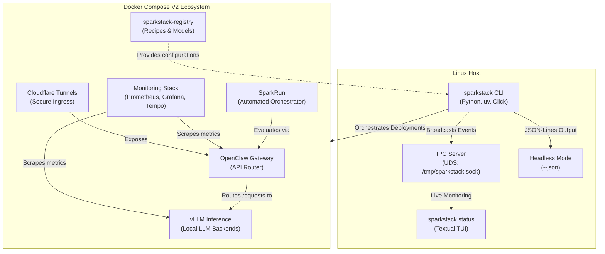

# Spark Services Orchestrator

This repository serves as the primary deployment orchestrator for the Spark ecosystem, managing the `openclaw` backend, `sparkrun` orchestrator, and various local LLM (vLLM) backend stacks.

## Architecture

The Spark Services Orchestrator (`sparkstack`) acts as the command center for the entire Spark AI ecosystem. It provides a robust, async-first Python CLI to manage the lifecycle of various interconnected services. 

### System Diagram



### Component Overview

- **Orchestrator CLI (`sparkstack`)**: A unified command-line tool built with Python and Click. It handles building, deploying, updating, and syncing the multi-service stack. It supports headless execution (`--json`) for automation and CI pipelines.
- **IPC Monitoring**: During deployments, the CLI spins up an async Unix Domain Socket (UDS) server that broadcasts live JSON-Lines events. The `sparkstack status` TUI connects to this socket for real-time monitoring.
- **Docker Compose V2**: Used to securely isolate and network the various AI services. The orchestrator generates and applies Compose configurations dynamically based on deployment recipes.
- **OpenClaw Gateway**: The core API router and backend gateway. It proxies requests to the appropriate inference backends and manages access.
- **SparkRun**: An automated orchestration and evaluation engine that works alongside OpenClaw to run AI workloads.
- **vLLM Inference**: High-throughput LLM inference backends spun up dynamically based on the active stack configuration.
- **Monitoring Stack**: A comprehensive observability suite utilizing Prometheus, Grafana, and Tempo (managed via Grafana Alloy) to track system health, performance, and memory usage.
- **Registry (`sparkstack-registry`)**: A centralized source dependency that holds deployment recipes and model configurations used by the orchestrator to build the environment.

> **Note**: This repository is designed to be a deployment orchestrator. It manages `openclaw`, `sparkrun`, and `sparkstack-registry` as source dependencies in `../`. You will need access to those repositories to fully initialize this project, or you must configure it to point to public images.

## Prerequisites

- **Linux Host** (Ubuntu / Debian recommended)
- **Docker & Docker Compose V2**
- **uv** (Python package installer and runner)
- **tmux** (for detached background process management)

## Getting Started

1. **Clone the repository:**

   ```bash
   git clone https://github.com/jlapenna/sparkstack.git
   cd sparkstack
   ```

1. **Clone source dependencies (if you have access):**

   Ensure `openclaw`, `sparkrun`, and `sparkstack-registry` are cloned in the parent directory (`../`).

1. **Configure Environment:**
   Copy `.env.example` to `.env` and fill in the appropriate values.

   ```bash
   cp .env.example .env
   ```

1. **Launch the Service Stack:**
   You can use the built-in python scripts (via `uv`) to orchestrate and update the deployment:

   ```bash
   uv run manager/update_services.py
   ```

## Development and Host Tuning

See [DEVELOPMENT.md](DEVELOPMENT.md) for critical host-level tuning to ensure Docker does not conflict with SSH, and that `inotify` limits are high enough for hot-reloading development.

## Contributing

Please refer to [DEVELOPMENT.md](DEVELOPMENT.md) for setup and development guidelines, and [AGENTS.md](AGENTS.md) for contribution protocols.

## License

This project is licensed under the MIT License - see the [LICENSE](LICENSE) file for details.
