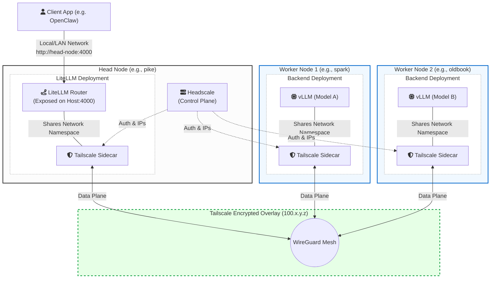
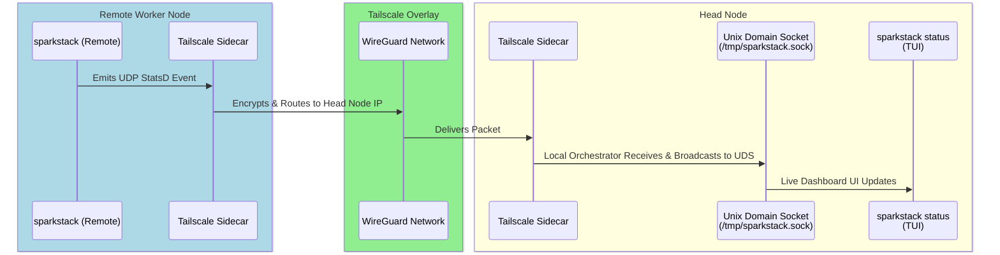

# Multi-Node Cluster Support Blueprint

## 1. Overview & Architecture

The objective of this initiative is to extend `sparkstack` from a single-node deployment system to a fully distributed orchestration platform. This will allow the core orchestrator, gateway (OpenClaw), and monitoring infrastructure to reside on a lightweight head node (e.g., `pike`), while heavy LLM inference backends (e.g., vLLM) are delegated to specialized, GPU-heavy remote worker machines (e.g., `spark`, `oldbook`).

### 1.1 Networking & Security: Headscale + Tailscale Sidecars

To ensure secure, agentless, and seamless communication across the cluster, we will implement an Encrypted Network Overlay using **Headscale** (Control Plane) and **Tailscale** (Data Plane).

- **Control Plane (Headscale):** A central Headscale server will be deployed on the head node. This self-hosted server acts as the coordinator, managing node identities, IP address allocation, and access controls without relying on external SaaS providers.
- **Data Plane (Tailscale Client):** Instead of installing software directly on the host OS of the worker machines, we will dynamically inject the official **Tailscale Docker client** as a sidecar container into every remote backend deployment.
- **Routing & Isolation:** Remote backend containers (like vLLM) will utilize `network_mode: "service:tailscale-sidecar"` to route all their inbound and outbound traffic through the encrypted mesh network. The main backend service will not expose any ports directly to the host.
- **Security:** This overlay ensures that all OTLP traces, UDP telemetry, and Docker API calls are automatically encrypted peer-to-peer using WireGuard. No complex application-layer TLS configuration or API keys are required within Sparkstack's internal communications.

### 1.2 Architecture Diagram



## 2. Telemetry & Observability Pipeline

Monitoring a distributed setup requires a robust, location-agnostic telemetry pipeline.

1. **Lightweight Daemons:** Remote worker hosts will run minimal, high-performance C daemons (such as `nv-monitor`) to expose native, Prometheus-compatible system and GPU endpoints.
1. **Encrypted Exporters:** Exporters running on remote nodes will be attached to their own Tailscale sidecars or accessed via the host's Tailscale IP, ensuring metrics are never exposed to the public internet.
1. **UDP Telemetry Routing:** Remote orchestration scripts will push real-time deployment lifecycle events via the existing **UDP socket system (StatsD)** directly to the head node's Tailscale overlay IP.
1. **Local Broadcast via UDS:** When the orchestrator receives UDP events, they are broadcast locally to the **Unix Domain Socket (UDS)** (`/tmp/sparkstack.sock`).
1. **Seamless TUI Integration:** The `sparkstack status` CLI reads exclusively from the local UDS. This keeps the user interface entirely agnostic of whether the deployment progress is happening locally or remotely.

### 2.1 Observability Event Flow



## 3. User Experience & Cluster Configuration

To ensure seamless alignment with the existing `sparkrun` ecosystem, `sparkstack` will adopt a compatible "cluster" configuration schema.

### 3.1 Centralized Cluster Definitions

Similar to how `sparkrun` manages named clusters, `sparkstack` will support cluster definitions stored in YAML (e.g., `~/.config/sparkstack/clusters/<cluster_name>.yaml`). This configuration describes the available hosts, defining their Tailscale overlay IPs and SSH usernames.

**Example `mylab.yaml`:**

```yaml
name: mylab
description: "Distributed inference cluster"
user: ubuntu
hosts:
  - spark-tailscale-ip
  - oldbook-tailscale-ip
```

### 3.2 Target Resolution & CLI

Users can choose to target specific hosts manually using inline overrides, or deploy across an entire saved cluster:

```bash
# Manual host targeting via inline overrides
sparkstack build my-cluster \
  main=sparkrun/qwen.yaml:target=spark-tailscale-ip \
  embedding=sparkrun/jina.yaml:target=oldbook-tailscale-ip

# Automated targeting using a saved cluster config
sparkstack build my-cluster --cluster mylab \
  main=sparkrun/qwen.yaml \
  embedding=sparkrun/jina.yaml
```

When `--cluster` is used, `sparkstack` will read the cluster configuration and automatically distribute the `sparkrun` backend targets among the available `hosts`. This allows us to leverage the same host resolution, validation, and SSH connection logic that `sparkrun` already employs.

## 4. Documentation & Network Topology Guide

Introducing Headscale and Tailscale sidecars into a Docker Compose environment requires clear documentation to prevent routing confusion.

### 4.1 The Two Networks

- **The Local Bridge (`sparkstack_default`):** All services running on the head node (OpenClaw, Headscale, Orchestrator, Monitoring) reside on a standard Docker bridge network. They communicate using internal Docker DNS (e.g., `http://openclaw:8000`).
- **The Tailscale Overlay (`100.x.y.z`):** Remote worker nodes communicate *exclusively* over the Tailscale overlay network.

### 4.2 Head Node Configuration (Headscale)

- **Deployment & Exposure:** Headscale runs on the head node. While it attaches to the `sparkstack_default` network for local access, it **must** expose a port to the host (e.g., `ports: ["8080:8080"]`).
- **Routable Control Plane:** Remote Tailscale sidecars require continuous access to Headscale for node map updates and key rotation. `SPARKSTACK_HEADSCALE_SERVER` must be set to the head node's routable LAN IP or DNS name. The `sparkstack` CLI will auto-detect the host's primary LAN IP, but users can override this by explicitly setting `SPARKSTACK_HEADSCALE_SERVER` in their `.env` file.
- **Configuration:** A base `config.yaml` is stored in `services/headscale/config/`, configured to reject open registrations for security on the LAN, and explicitly configured to enable **MagicDNS** (e.g., setting a `base_domain`).
- **Pre-Auth Keys:** During `sparkstack setup`, the CLI generates a persistent Headscale pre-auth key and saves it to `.env` as `SPARKSTACK_HEADSCALE_AUTH_KEY`. This acts as the sole secure authorization mechanism for remote nodes.

### 4.3 Remote Node Configuration (Tailscale Sidecars)

- **Sidecar Injection:** When a service is deployed remotely, the orchestrator injects a `tailscale/tailscale` sidecar container into the generated `docker-compose.{host}.yml`.
- **Network Mode:** The main backend container (e.g., vLLM) has its network mode set to `network_mode: "service:tailscale-sidecar"`. It binds to localhost, which the sidecar transparently exposes to the Tailnet.
- **Zero-Touch Provisioning:** The remote host requires *no* manual configuration or VPN installation. The sidecar container automatically authenticates using the `SPARKSTACK_HEADSCALE_AUTH_KEY` injected from the head node's orchestrator.

### 4.4 The Gateway Bridge (Connecting the Two)

To allow the local services to route traffic to the remote vLLM backends (on the Tailnet):

- A dedicated Tailscale client sidecar (`sparkstack-gateway-tailscale`) is attached to the LiteLLM gateway deployment.
- **Inbound Traffic (Real Network):** LiteLLM's primary port (e.g., 4000) will be published directly to the host's real network (via the sidecar's `ports` directive), ensuring it remains accessible to OpenClaw, LAN clients, and other local services.
- **Outbound Traffic (Tailnet):** LiteLLM uses the sidecar's network space to route outbound inference requests to the `100.x.y.z` Tailscale IPs of the remote workers, effectively acting as the bridge between the real network and the distributed backend cluster.

## 5. Detailed Implementation Steps

### Step 1: Core Builder Context Extraction

**Target File:** `sparkstack/core/builders/stack.py`
**Target File:** `sparkstack/core/schemas.py`

- **Schema Update:** Update the Pydantic schema for model requests to accept an optional `target` field.
- **Extraction:** Modify `_process_model_request()` to parse the `target` parameter from the model override dictionary.
- **Context Injection:** Inject the parsed `target_host` into the `context` dictionary passed to all service handlers. This ensures all downstream builders (Docker, LiteLLM, monitoring) are aware of the deployment destination.

### Step 2: Multi-Host Compose Generation & Synchronized Orchestration

**Target File:** `sparkstack/core/builders/docker.py`
**Target File:** `sparkstack/manager/launch.py`

- **Group by Target:** `sparkstack` must group all active services by their `target_host` during the build phase.
- **File Generation:** Instead of a single `docker-compose.yml`, generate one compose file per target node (e.g., `docker-compose.localhost.yml`, `docker-compose.spark.yml`).
- **Remote Synchronization & Volumes (CRITICAL):** Docker Compose over SSH resolves relative volume mounts against the *remote* filesystem. Therefore, local configuration files and generated manifests must be synced before deployment. `launch_stack()` must:
  1. Identify all unique remote targets.
  1. Write all necessary configurations to the local stack directory (e.g., `sparkstack-registry/stacks/[STACK_NAME]`).
  1. Use `rsync -avz --delete` to synchronize this directory to a mirrored path on the target host (e.g., `/tmp/sparkstack/stacks/[STACK_NAME]`).
  1. Because the directories are perfectly mirrored, relative volume paths in the compose file (e.g., `./config:/app/config`) will safely resolve to the synced files on the remote worker.
- **Remote Execution:** Execute Docker commands over SSH targeting the newly synced remote path:
  ```bash
  DOCKER_HOST=ssh://user@{target_host} docker compose -f /tmp/sparkstack/stacks/[STACK_NAME]/docker-compose.{target}.yml up -d
  ```
- **Prerequisites:** This workflow strictly assumes the orchestrating user has SSH key-based access configured and verified for the target hosts.
- **Cluster State & Orphan Teardown:** `sparkstack` must maintain a local state tracking mechanism to know which remote nodes are active for a stack. When a stack is updated and a target node is removed, the orchestrator must execute `docker compose down` on that specific remote node to tear down orphaned containers before removing it from tracking.
- **Model Weight Caching & Distribution:** To align with `sparkrun`'s optimized behavior, model files **WILL** be synced via `rsync`. The head node will download the model to its local Hugging Face cache using the `HF_TOKEN`. Once cached locally, the orchestrator will `rsync` the cache directory to the remote workers. This "push" model prevents multiple workers from simultaneously hammering the Hugging Face Hub, saves overall bandwidth, and removes the need to securely distribute the `HF_TOKEN` to every remote worker.

### Step 3: Dynamic Tailscale Sidecar Injection

**Target File:** `sparkstack/core/builders/docker.py`

- When constructing the compose dictionary for a remote target, inject a sidecar container for every service that exposes an external port.
- **Sidecar Definition Example:**
  ```yaml
  vllm-main-tailscale:
    image: tailscale/tailscale:latest
    hostname: "vllm-main-${TARGET_HOST}"
    environment:
      - TS_AUTHKEY=${HEADSCALE_AUTH_KEY}
      - TS_ROUTES=...
      - TS_EXTRA_ARGS=--login-server=${HEADSCALE_LOGIN_SERVER}
    cap_add: [NET_ADMIN, NET_RAW]
    ports: ["8000:8000"] # Ports are transferred here from the main service
    volumes:
      - tailscale-state-vllm-main-${TARGET_HOST}:/var/lib/tailscale # Preserves node identity
  ```
- **Service Modification:** The primary service (e.g., `vllm-main`) will have its `ports` directive removed and replaced with:
  ```yaml
  network_mode: "service:vllm-main-tailscale"
  depends_on:
    - vllm-main-tailscale
  ```

### Step 4: Headscale Server Deployment & Auto-Provisioning

**Target File:** `sparkstack/core/config.py`
**Target File:** `services/headscale/docker-compose.yml`

- **Deployment:** Headscale will be deployed as a foundational core service on the head node (`localhost`), initialized alongside other orchestration services.
- **State Persistence:** Must mount a persistent Docker volume (`headscale-data:/var/lib/headscale`) to ensure node identities, cryptographic keys, and overlay IP assignments survive container restarts.
- **Auth Flow & Provisioning:**
  1. An administrative script (or `sparkstack` setup command) will execute `headscale preauthkeys create --reusable --expiration 365d` to generate a PreAuth key. (Note: Using a reusable key means the orchestrator must securely manage it and plan for rotation before expiration, or alternatively, generate single-use keys dynamically per deployment).
  1. The system will auto-detect the local network IP (or read the override) to determine `SPARKSTACK_HEADSCALE_SERVER` (e.g., `http://headscale-ip:8080`) and store it alongside `SPARKSTACK_HEADSCALE_AUTH_KEY` in the local `.env` file.
  1. These environment variables will be dynamically injected into the generated `docker-compose.{target}.yml` files so remote Tailscale sidecars can authenticate upon boot.

### Step 5: Service Handler & Gateway Routing Configuration

**Target File:** `sparkstack/core/handlers/sparkrun.py`

- **Backend Target Definition:** Update the `backend` dictionary returned by `apply_to_builders()` to explicitly include `"target": self.context["target_host"]`.
- **LiteLLM Gateway Routing:** Configure the `LiteLLMBuilder` to route incoming backend requests to `http://vllm-main-{target_host}:{self.port}/v1`.
  - If the target is a remote node, `vllm-main-{target_host}` will successfully resolve via Tailscale **MagicDNS** (enabled in Headscale), routing traffic over the Tailnet overlay.
  - If the target is `localhost`, the router should continue using local internal Docker DNS resolution (e.g., `http://{container_hostname}:{port}/v1`).
- **Tailscale Sidecar for LiteLLM:** Ensure the LiteLLM deployment is injected with the Tailscale sidecar so it can reach the remote backends, while OpenClaw continues to talk to LiteLLM over the local Docker bridge.

### Step 6: Error Handling & Resilience

- **SSH & Rsync Failures:** If `rsync` or the SSH tunnel fails to connect, the orchestrator must fail fast and surface a clear network error in the UDS event stream, rather than hanging indefinitely.
- **Sidecar Health Checks:** Add Docker `healthcheck` directives to the Tailscale sidecars to ensure the overlay network connection is established *before* the backend services attempt to bind to the network interface.
- **Orphaned Containers:** Implement cleanup logic to tear down remote compose stacks when a deployment is destroyed or switched, preventing resource leaks on worker nodes.
