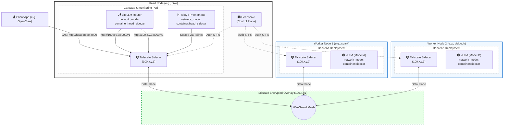
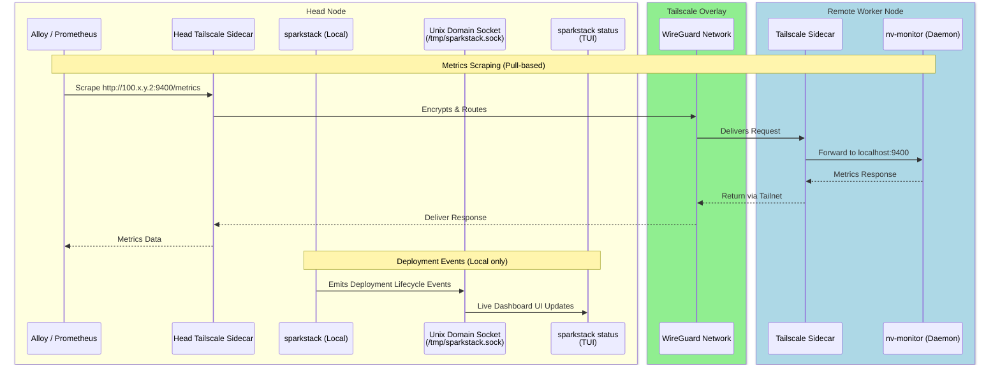
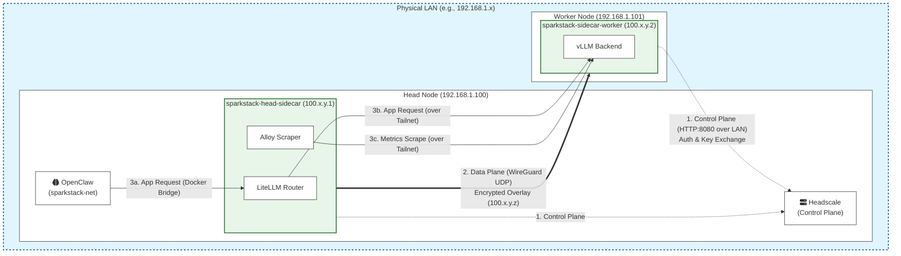

# Multi-Node Cluster Support Blueprint

## 1. Overview & Architecture

The objective of this initiative is to extend `sparkstack` from a single-node deployment system to a fully distributed orchestration platform. This will allow the core orchestrator, gateway (OpenClaw), and monitoring infrastructure to reside on a lightweight head node (e.g., `pike`), while heavy LLM inference backends (e.g., vLLM) are delegated to specialized, GPU-heavy remote worker machines (e.g., `spark`, `oldbook`).

### 1.1 Delegation Model: sparkrun-native

**Architectural decision:** `sparkstack` continues to delegate backend container lifecycle to `sparkrun` via `sparkrun run --hosts`. It does NOT directly manage remote Docker daemons for backends. `sparkstack`'s new responsibilities are limited to:

1. **Infrastructure pre-deployment** — deploying Tailscale sidecars on remote workers (and the head node) before `sparkrun` launches backends.
1. **Network flag orchestration** — passing the correct `--network` and environment flags to `sparkrun` so backends join the Tailscale sidecar's network namespace.
1. **Config generation** — generating LiteLLM configs with Tailnet IPs for remote backend routing.

This avoids reimplementing sparkrun's model distribution, health checking, container lifecycle, and SSH execution.

### 1.2 Integration Approach: Shell-Out to sparkrun CLI

**Architectural decision:** `sparkstack` interacts with `sparkrun` exclusively via CLI subprocesses (e.g., `uv run sparkrun cluster status --json`). It does NOT import sparkrun's internal Python APIs directly.

**Rationale:**

- `sparkstack` already follows this pattern in `launch.py` (shelling out to `sparkrun run`).
- Loose coupling keeps sparkrun's internal API surface free to evolve without breaking sparkstack.
- CLI commands like `cluster status --json` and `stop` are the public, stable interface.
- Subprocess overhead is negligible for infrequent orchestration calls (deploy, teardown, health-check).

**Available sparkrun CLI commands for orchestration:**

| sparkstack needs to...             | sparkrun CLI command                                     | JSON output?    |
| ---------------------------------- | -------------------------------------------------------- | --------------- |
| Check backends running on hosts    | `sparkrun cluster status --cluster X --json`             | ✅              |
| Check a specific job's liveness    | `sparkrun cluster check-job {target} --cluster X --json` | ✅              |
| Stop backends on specific hosts    | `sparkrun stop {recipe} --cluster X`                     | ✅ (exit code)  |
| Stop all sparkrun containers       | `sparkrun stop --all --cluster X`                        | ✅ (exit code)  |
| Get backend logs from remote hosts | `sparkrun logs {cluster_id}`                             | N/A (streaming) |

**State management split:** Backend state (hosts, ports, container names, health) is queried from sparkrun via these CLI commands at the point of need. Sparkstack maintains its own `.state.json` only for Tailscale infrastructure that sparkrun has no concept of (see Step 6).

**Future consideration:** Tightening the dependency via direct Python imports (e.g., `from sparkrun.orchestration.job_metadata import load_job_metadata`) is identified as a high-value future refactor. sparkrun is already an editable path dependency, making this a zero-friction change when the API surface stabilizes.

### 1.3 Networking & Security: Headscale + Tailscale

To ensure secure, seamless communication across the cluster, we implement an Encrypted Network Overlay using **Headscale** (Control Plane) and **Tailscale** (Data Plane).

- **Control Plane (Headscale):** A central Headscale server (pinned to `v0.28.x`, the current stable release) deployed on the head node. Manages node identities, IP allocation, and access controls without external SaaS. **MagicDNS is disabled** — all routing uses raw Tailnet IPs for simplicity and resilience in automated orchestration.
- **Head Node (Tailscale Sidecar):** The head node runs a Tailscale sidecar container (`sparkstack-head-sidecar`) attached to the local Docker bridge networks. Core routing services (LiteLLM) and monitoring services (Alloy/Prometheus) share this sidecar's network namespace. This ensures zero interference with any pre-existing Tailscale installation on the host OS.
- **Worker Nodes (Tailscale Sidecar Containers):** Worker machines remain fully agentless. The official `tailscale/tailscale` Docker image is deployed as a standalone sidecar container on each worker via SSH. Backend containers (vLLM) join the sidecar's network namespace using `network_mode: container:{sidecar_name}`, binding to `0.0.0.0:{port}` inside the sidecar's network namespace. This makes backends reachable at the sidecar's Tailnet IP without exposing any ports on the worker's physical network.
- **Security:** All cross-node traffic (inference requests, OTLP traces, Prometheus scrapes) is encrypted peer-to-peer via WireGuard. No application-layer TLS or API keys are needed for internal communications.

### 1.4 Architecture Diagram



## 2. Telemetry & Observability Pipeline

Monitoring a distributed setup requires a robust, location-agnostic telemetry pipeline.

1. **Lightweight Daemons:** Remote worker hosts will run minimal, high-performance C daemons (such as `nv-monitor`) to expose native, Prometheus-compatible system and GPU endpoints.
1. **Encrypted Exporters:** Exporters running on remote nodes are accessed via their Tailscale sidecar's Tailnet IP, ensuring metrics are never exposed to the public internet.
1. **Centralized Orchestration Events:** Because the `sparkstack` orchestrator runs entirely on the head node (managing remote nodes via SSH), deployment lifecycle events are generated locally. They are broadcast directly to the local **Unix Domain Socket (UDS)** (`/tmp/sparkstack.sock`) without needing to cross the Tailscale network.
1. **Seamless TUI Integration:** The `sparkstack status` CLI reads exclusively from the local UDS. This keeps the user interface entirely agnostic of whether the deployment progress is happening locally or remotely.

### 2.1 Observability Event Flow



## 3. User Experience & Cluster Configuration

To avoid maintaining parallel cluster definitions, `sparkstack` will **reuse `sparkrun`'s existing `ClusterManager`** infrastructure for host resolution and SSH configuration.

### 3.1 sparkrun Cluster Reuse

`sparkrun` already stores cluster definitions at `~/.config/sparkrun/clusters/<name>.yaml` via its `ClusterManager`. These include hosts, SSH users, cache directories, and transfer mode.

`sparkstack` extends this by maintaining a thin supplementary config at `~/.config/sparkstack/clusters/<name>.yaml` that stores **only** sparkstack-specific metadata not present in sparkrun's schema:

```yaml
# ~/.config/sparkstack/clusters/mylab.yaml
# References the sparkrun cluster of the same name for host/SSH details.
sparkrun_cluster: myoverlay:
  headscale_server: YOUR_SERVER_IP:8080
head_tailnet_ip: 100.64.0.1  # Persisted after initial setup
```

Host lists, SSH users, and cache directories come from `sparkrun`'s cluster definition. This ensures a single source of truth for host inventory.

### 3.2 Target Resolution & CLI

Users can choose to target specific hosts manually using inline overrides, or deploy across an entire saved cluster:

```bash
# Manual host targeting via inline overrides
sparkstack build my-cluster \
  main=sparkrun/qwen.yaml:target=spark \
  embedding=sparkrun/jina.yaml:target=oldbook

# Automated targeting using a saved cluster config
sparkstack build my-cluster --cluster mylab \
  main=sparkrun/qwen.yaml \
  embedding=sparkrun/jina.yaml
```

When `--cluster` is used, `sparkstack` reads the sparkrun cluster configuration for host inventory and SSH settings, and its own supplementary config for Tailnet metadata. Host resolution, validation, and SSH connection logic are delegated to `sparkrun`'s existing `ClusterManager`.

## 4. Network Topology Guide

### 4.1 The Three Networks

- **`sparkstack-net` (Local Docker Bridge):** Head node orchestration services (OpenClaw, Headscale) reside here.
- **`vllm-network` (Local Docker Bridge):** Shared network for local inference traffic.
- **Tailscale Overlay (`100.x.y.z`):** Remote worker nodes communicate exclusively over the encrypted Tailnet. The head node reaches these IPs via its `sparkstack-head-sidecar` container.

**Key rule:** Remote backends do NOT join `sparkstack-net` or `vllm-network`. They are only reachable via their Tailnet IPs.

### 4.2 Network Planes and Routing Diagram

The following diagram illustrates how the Control Plane (Headscale), Data Plane (Tailscale Overlay), and Application traffic interact across the physical network and Docker bridges:



### 4.3 Head Node Configuration (Headscale)

- **Deployment & Exposure:** Headscale runs on the head node as a Docker container on `sparkstack-net`. It **must** expose a port to the host (e.g., `ports: ["8080:8080"]`).
- **Routable Control Plane:** Remote Tailscale sidecars require continuous access to Headscale for node map updates and key rotation. `SPARKSTACK_HEADSCALE_SERVER` must be set to the head node's routable LAN IP or DNS name. The `sparkstack` CLI will auto-detect the host's primary LAN IP, but users can override this.
- **Configuration:** A base `config.yaml` is stored in `services/headscale/config/`, configured to reject open registrations. **MagicDNS is disabled** (`dns.magic_dns: false`) — all service routing uses raw Tailnet IPs, avoiding DNS resolution dependencies in the automation path. Hostnames are still set via `TS_HOSTNAME` for human-readable `tailscale status` output, but they are not used for routing.
- **Pre-Auth Keys:** During `sparkstack setup`, the CLI generates a persistent Headscale pre-auth key and saves it to `.env` as `SPARKSTACK_HEADSCALE_AUTH_KEY`.

### 4.4 Head Node Configuration (Tailscale Sidecar)

To achieve 100% isolation from any existing Tailscale network on the head node, we deploy a Head Node Sidecar instead of installing Tailscale on the host.

- **Deployment:** A `tailscale/tailscale` container named `sparkstack-head-sidecar` is deployed on the head node.
- **Network Attachments:** It is explicitly attached to `sparkstack-net` and `vllm-network`.
- **Port Exposure:** Since other containers (LiteLLM, Alloy) will share its network namespace, the `sparkstack-head-sidecar` MUST expose their required ports to the host and bridge networks (e.g., `-p 4000:4000` for LiteLLM, `-p 4318:4318` for OTLP, `-p 9090:9090` for Prometheus). **This host-port exposure is intentional** — it enables local CLI tools (smoke tests, `curl` debugging, `sparkstack wait`) to reach LiteLLM at `localhost:4000` without routing through Docker DNS.
- **Zero-Touch:** It authenticates to the local Headscale server using the same `SPARKSTACK_HEADSCALE_AUTH_KEY` as remote workers.

### 4.5 Remote Node Configuration (Tailscale Sidecars)

- **Standalone Sidecar:** Before any backend is deployed, sparkstack deploys a `tailscale/tailscale` container on the remote host via SSH + `docker run`. This sidecar runs independently — it is NOT part of the backend's compose file.
- **Network Namespace Sharing:** sparkrun launches the backend container with `network_mode: container:{sidecar_name}`, binding to `0.0.0.0:{port}` inside the sidecar's namespace.
- **Zero-Touch Provisioning:** The remote host requires no manual configuration. The sidecar authenticates using `SPARKSTACK_HEADSCALE_AUTH_KEY` injected at deploy time.
- **Sidecar Configuration:**
  - `TS_STATE_DIR=/var/lib/tailscale` (explicit, matching the volume mount)
  - `TS_ACCEPT_DNS=false` (prevents sidecar from overriding container DNS)
  - `TS_HOSTNAME=sparkstack-{role}-{host}` (human-readable identifier in `tailscale status`, not used for routing)
  - Healthcheck: `tailscale status --json` to verify mesh connection before backend launch

### 4.6 Gateway Routing (Head Node → Remote Backends)

**LiteLLM and Monitoring share the Head Node Sidecar.**

Because we avoid installing Tailscale on the host, head node services that need to route to the Tailnet must do so via the `sparkstack-head-sidecar`:

1. LiteLLM, Alloy, and Prometheus are launched with `network_mode: container:sparkstack-head-sidecar`.
1. The `sparkstack-head-sidecar` container is attached to `sparkstack-net` and `vllm-network`.
1. Other services on `sparkstack-net` (like OpenClaw) can reach LiteLLM by calling `http://sparkstack-head-sidecar:4000` (since LiteLLM shares the sidecar's network namespace).
1. For remote backends, LiteLLM routes via the Tailnet naturally because it shares the sidecar's networking stack: `backend_url=http://{worker_tailnet_ip}:{port}/v1`.
1. For local backends, LiteLLM continues using Docker DNS via the shared bridge attachment: `http://main_solo:8000/v1`.

This achieves total network isolation without requiring any host-level software dependencies on the head node.

## 5. Detailed Implementation Steps

### Step 1: Core Builder Context Extraction

**Target File:** `sparkstack/core/builders/stack.py`
**Target File:** `sparkstack/core/schemas.py`

- **Schema Update:** Update the Pydantic schema for model requests to accept an optional `target` field (hostname from sparkrun's cluster definition).
- **Extraction:** Modify `_process_model_request()` to parse the `target` parameter from the model override dictionary.
- **Context Injection:** Inject the parsed `target_host` into the `context` dictionary passed to all service handlers. This ensures all downstream builders (Docker, LiteLLM, monitoring) are aware of the deployment destination.
- **Locality Flag:** Add a `is_remote` boolean derived from `target_host != "localhost"`. This flag drives all conditional logic below.

### Step 2: Two-Phase Remote Infrastructure Deployment

**Target File:** `sparkstack/manager/launch.py` (new helper: `sparkstack/manager/remote.py`)

This step deploys Tailscale sidecars on remote workers **before** sparkrun launches any backends. This resolves the IP resolution chicken-and-egg: sidecar Tailnet IPs are known before LiteLLM config generation.

**Phase 1: Deploy Tailscale sidecars (Head + Workers)**

First, deploy the head node sidecar (`sparkstack-head-sidecar`). It binds required gateway ports:

```bash
docker run -d \
  --name sparkstack-head-sidecar \
  --cap-add NET_ADMIN,NET_RAW \
  --network sparkstack-net \
  --restart unless-stopped \
  -p 4000:4000 -p 4318:4318 -p 9090:9090 \
  -v sparkstack-ts-state-head:/var/lib/tailscale \
  -e TS_AUTHKEY={auth_key} \
  -e TS_STATE_DIR=/var/lib/tailscale \
  -e TS_ACCEPT_DNS=false \
  -e TS_EXTRA_ARGS="--login-server=http://{headscale_server}" \
  tailscale/tailscale:{pinned_version}
# Also attach to vllm-network
docker network connect vllm-network sparkstack-head-sidecar
```

Then, for each unique remote `target_host`:

1. SSH into the remote host (using sparkrun's `ClusterManager` for credentials).
1. Deploy the Tailscale sidecar as a standalone container:
   ```bash
   ssh user@{host} docker run -d \
     --name sparkstack-sidecar-{role} \
     --cap-add NET_ADMIN,NET_RAW \
     -v sparkstack-ts-state-{role}:/var/lib/tailscale \
     -e TS_AUTHKEY={auth_key} \
     -e TS_EXTRA_ARGS="--login-server=http://{headscale_server}" \
     -e TS_HOSTNAME=sparkstack-{role}-{host} \
     -e TS_STATE_DIR=/var/lib/tailscale \
     -e TS_ACCEPT_DNS=false \
     --restart unless-stopped \
     tailscale/tailscale:{pinned_version}
   ```
1. Wait for sidecar health on all nodes.

**Phase 2: Resolve Tailnet IPs**

After all sidecars are healthy:

1. Query each sidecar's Tailnet IP:
   ```bash
   ssh user@{host} docker exec sparkstack-sidecar-{role} tailscale ip -4
   ```
1. Store the mapping `{role} → {tailnet_ip}` in the build context for use by LiteLLM config generation (Step 5).
1. Persist the mapping to the local state file (see Step 7).

**Phase 3: Launch backends via sparkrun**

For each backend, `launch_stack()` calls `sparkrun run` with modified flags based on locality:

```python
cmd = [
    "uv", "run", "sparkrun", "run", str(recipe_path),
    "--hosts", backend["target"],
    "--port", str(backend["port"]),
    ...
    "--solo", "--no-follow",
]

if backend["is_remote"]:
    # Remote: join the pre-deployed sidecar's network namespace
    cmd.extend(["-o", f"network=container:sparkstack-sidecar-{backend['role']}"])
    # Inject OTEL endpoint pointing to head node's Tailnet IP
    cmd.extend(["-o", f"env.OTEL_EXPORTER_OTLP_ENDPOINT=http://{head_tailnet_ip}:4318"])
else:
    # Local: join the local Docker bridge (current behavior)
    cmd.extend(["-o", f"network={global_network}"])
```

**Key change:** Remote backends use `network=container:sparkstack-sidecar-{role}` instead of `network=sparkstack-net`. This makes the backend share the sidecar's network namespace, binding to `0.0.0.0:{port}` inside it. The backend becomes reachable at the sidecar's Tailnet IP. The `--solo` flag remains compatible because `sparkrun run --solo` passes `-o network=...` directly to `docker run --network=...`.

**Validated override path (Phase 0 complete):** The `-o network=container:...` override has been confirmed to work end-to-end through sparkrun's existing code:

1. `_parse_options()` parses `network=container:sparkstack-sidecar-main` into a dict (`coerce_value` correctly preserves the `container:` prefix as a raw string)
1. `_apply_recipe_overrides()` merges the override into the recipe config chain
1. `ExecutorConfig.from_chain()` resolves the `network` field
1. `DockerExecutor._build_default_opts()` emits `--network=container:sparkstack-sidecar-main`

No sparkrun code changes are required for this integration point.

### Step 3: Headscale Server Deployment & Auto-Provisioning

**Target File:** `sparkstack/core/config.py`
**Target File:** `services/headscale/docker-compose.yml`

- **Deployment:** Headscale will be deployed as a foundational core service on the head node, initialized alongside other orchestration services on `sparkstack-net`.

- **Version Pinning:** Pin to `headscale/headscale:0.28.0` (current stable as of 2026-05). The Headscale API surface changed significantly between 0.22→0.23 (gRPC replaced with REST). v0.28 uses the `headscale` CLI for pre-auth key generation:

  ```bash
  # Generate a reusable pre-auth key (v0.28 CLI syntax)
  docker exec sparkstack-headscale headscale preauthkeys create --user sparkstack --reusable --expiration 87600h
  ```

- **State Persistence:** Mount a persistent Docker volume (`headscale-data:/var/lib/headscale`) to ensure node identities, cryptographic keys, and overlay IP assignments survive container restarts.

- **User Management:** Headscale v0.28 does **not** auto-create users. The setup flow must explicitly create and manage the `sparkstack` namespace user before generating pre-auth keys. User creation is idempotent — re-running on an existing user is a no-op error that the setup script handles gracefully.

- **Auth Flow & Provisioning:**

  1. During `sparkstack setup`, the CLI starts Headscale and waits for it to become healthy.
  1. Create the Headscale user (idempotent):
     ```bash
     docker exec sparkstack-headscale headscale users create sparkstack 2>/dev/null || true
     ```
  1. Generate a reusable pre-auth key under that user:
     ```bash
     docker exec sparkstack-headscale headscale preauthkeys create \
       --user sparkstack --reusable --expiration 87600h
     ```
  1. Store the key as `SPARKSTACK_HEADSCALE_AUTH_KEY` in `.env`.
  1. The head node sidecar uses this to connect. Its Tailnet IP is retrieved and stored as `SPARKSTACK_HEAD_TAILNET_IP` in `.env`.
  1. `SPARKSTACK_HEADSCALE_SERVER` is auto-detected from the host's primary LAN IP (user-overridable in `.env`).

  **Key lifecycle:** The pre-auth key has a 10-year expiration (`87600h`). If the key is rotated or expires, re-run `sparkstack setup` to regenerate. All existing sidecars remain authenticated — only new sidecar enrollments require a valid key.

### Step 4: Service Handler & Gateway Routing Configuration

**Target File:** `sparkstack/core/handlers/sparkrun.py`
**Target File:** `sparkstack/core/builders/stack.py`

- **Backend Target Definition:** Update the `backend` dictionary returned by `apply_to_builders()` to include `"target": self.context["target_host"]` and `"is_remote": self.context["is_remote"]`.
- **LiteLLM Backend URL Generation:**
  - If `is_remote`: `backend_url = f"http://{tailnet_ip_map[role]}:{port}/v1"` — uses the Tailnet IP resolved in Step 2, Phase 2.
  - If local: `backend_url = f"http://{container_hostname}:{port}/v1"` — unchanged from today, uses Docker DNS on `sparkstack-net`.
- **LiteLLM and Monitoring Namespace Sharing:**
  - Update `litellm` and `monitoring` Compose builders to output `network_mode: container:sparkstack-head-sidecar` instead of traditional `networks` blocks.
- **No standalone gateway sidecar:** LiteLLM is effectively inside the head node's sidecar, so it reaches remote Tailnet IPs directly and accesses `sparkstack-net` hosts transparently.
- **OTEL Endpoint Injection:** For remote sparkrun invocations, the `OTEL_EXPORTER_OTLP_ENDPOINT` environment variable is overridden to `http://{SPARKSTACK_HEAD_TAILNET_IP}:4318` (read from `.env`, persisted at setup time). Local backends continue using `http://alloy:4318` via Docker DNS.

### Step 5: Per-Host Resource Accounting

**Target File:** `sparkstack/core/builders/stack.py` (`_check_constraints()`)
**Target File:** `sparkstack/core/env.py`

The current `_check_constraints()` sums VRAM and RAM across **all** backends and checks against a single host's ceiling. With multi-node, resource budgets must be **per-host**.

- **Host Resource Registry:** Extend the cluster supplementary config (Section 3.1) to support per-host resource overrides:
  ```yaml
  sparkrun_cluster: myoverlay:
  headscale_server: YOUR_SERVER_IP:8080
  head_tailnet_ip: 100.64.0.1
  host_resources:
    spark:
      max_docker_memory_gb: 240
      max_vram_utilization: 0.95
    oldbook:
      max_docker_memory_gb: 120
      max_vram_utilization: 0.80
  ```
- **Constraint Check Refactor:** `_check_constraints()` groups backends by `target_host` and validates each group against that host's resource limits. If no per-host override exists, fall back to the current global defaults from `env.py`.

### Step 6: State Tracking & Two-Tier Orphan Teardown

**Target File:** `sparkstack/manager/remote.py` (new)

#### 6.1 State Management Principle

> **sparkrun is the authority for backend state; sparkstack tracks only the infrastructure sparkrun doesn't know about (Tailscale sidecars).**

This avoids state duplication. Backend metadata (hosts, ports, container names, health) lives in sparkrun's existing state system (`~/.cache/sparkrun/jobs/`, `sparkrun cluster status`). Sparkstack maintains a lightweight file tracking only Tailscale-sidecar-specific metadata.

#### 6.2 Sidecar State File

- **State File:** `sparkstack-registry/stacks/{STACK_NAME}/.state.json`

  ```json
  {
    "deployed_at": "2026-05-10T17:00:00Z",
    "cluster_name": "mylab",
    "sidecars": {
      "spark": {
        "container_name": "sparkstack-sidecar-main",
        "tailnet_ip": "100.64.0.2",
        "role": "main"
      },
      "oldbook": {
        "container_name": "sparkstack-sidecar-secondary",
        "tailnet_ip": "100.64.0.3",
        "role": "secondary"
      }
    }
  }
  ```

  The `cluster_name` field is required for teardown resolution — `set_current.py` receives a `stack_name` and `stack_path` but has no way to derive the sparkrun cluster name without this mapping.

  This file contains **only** data that sparkrun has no concept of:

  - Sidecar container names (Tailscale infrastructure managed by sparkstack)
  - Tailnet IPs assigned by Headscale
  - Role-to-host mapping for sidecar association

  It does NOT contain backend container names, recipe info, ports, or any data already tracked by sparkrun.

- **Write on deploy:** After Phase 2 (IP resolution) succeeds, write/update the sidecar state file. This happens before sparkrun launches backends.

#### 6.3 Two-Tier Orphan Teardown

Teardown is split into two tiers matching the authority model:

**Tier 1: Backend teardown (delegated to sparkrun)**

Before deploying a new stack version, sparkstack delegates backend cleanup to sparkrun via CLI:

```bash
# Option A: Stop a specific job by recipe name
uv run sparkrun stop {recipe_name} --cluster {cluster_name}

# Option B: Stop all sparkrun containers across the cluster
uv run sparkrun stop --all --cluster {cluster_name}

# Option C: Query what's running first, then stop selectively
uv run sparkrun cluster status --cluster {cluster_name} --json
# Parse output, then stop specific cluster IDs
uv run sparkrun stop sparkrun_{cluster_id} --cluster {cluster_name}
```

This ensures sparkrun's internal metadata (job files, pending ops) stays synchronized. Never directly `docker rm -f` sparkrun-managed containers — that would leave orphaned metadata in `~/.cache/sparkrun/jobs/`.

**Tier 2: Sidecar teardown (managed by sparkstack)**

After backends are stopped, sparkstack handles sidecar cleanup using `.state.json`:

1. Compare the new target host set against the persisted sidecar state.
1. For any host present in state but absent in the new deployment:
   ```bash
   ssh user@{host} docker rm -f {sidecar_container_name}
   ```
1. Remove the host entry from `.state.json`.

**Partial failure handling:** If sidecar deployment succeeds but backend launch fails, the sidecar is left running (idempotent; next deploy reuses it). Sidecar state is written immediately after sidecar health confirmation, independent of backend launch success.

### Step 7: Error Handling & Resilience

- **SSH Failures:** If SSH connection to a remote host fails during any phase, the orchestrator must fail fast and surface a clear network error in the UDS event stream (`/tmp/sparkstack.sock`), rather than hanging indefinitely.
- **Sidecar Health Timeout:** Sidecar health polling (Phase 1) must have a configurable timeout (default: 60s). If the sidecar fails to connect to the Tailnet within the timeout, abort deployment for that target with a descriptive error.
- **Sidecar Docker Healthcheck:** The sidecar container includes a Docker `healthcheck` for use with `depends_on` in future compose-based approaches:
  ```yaml
  healthcheck:
    test: ["CMD", "tailscale", "status", "--json"]
    interval: 10s
    timeout: 5s
    retries: 6
  ```
- **Idempotent Sidecar Deployment:** Before creating a sidecar, check if one already exists for that role on the target host. If it exists and is healthy, skip creation. If it exists but is unhealthy, remove and recreate.
- **Orphaned Containers:** See Step 6 for the state-tracked orphan teardown mechanism.

### Step 8: Monitoring, Health Probes & Discovery Updates

The following subsystems hardcode `localhost` or assume local Docker access for health checks, service discovery, and teardown. They require conditional logic based on backend locality.

#### 8.1 Monitoring Builder (`sparkstack/core/builders/monitoring.py`)

**Current assumption:** `add_target()` registers scrape targets using local Docker DNS names (e.g., `main_solo:8001`). Prometheus on the head node can only resolve these for local containers.

**Required change:**

- For remote backends, `add_target()` must register the Tailnet IP instead of the Docker hostname: `{tailnet_ip}:{port}` rather than `{container_hostname}:{port}`.
- This means `SparkrunServiceHandler.apply_to_builders()` must pass the resolved Tailnet IP into the monitoring builder when `is_remote` is true.
- Local backends continue using Docker DNS names (no change).

**Cross-ref:** Step 4 (Service Handler & Gateway Routing) must be extended to cover this.

#### 8.2 Wait-for-Backends Health Probe (`sparkstack/manager/wait_for_backends.py`)

**Current assumptions:**

1. **Progress Manager probe (line 47):** `http://localhost:8126/status` — assumes the sparkrun progress manager runs on the head node. This remains correct because sparkrun's progress manager aggregates status centrally, but must be validated for remote backends.
1. **Crash log retrieval (line 74):** `docker logs --tail 20 {container}` — runs against the local Docker daemon. For remote backends, the container does not exist locally.
1. **Smoke tests (lines 245, 252):** `http://localhost:{litellm_port}/v1/...` — smoke tests run through LiteLLM on the head node. This remains correct regardless of backend location (LiteLLM proxies to remote backends).

**Required changes:**

- **Crash log retrieval:** For remote backends, use `ssh user@{host} docker logs --tail 20 {container}` instead of local `docker logs`. The backend's `target_host` must be available in the service discovery data (see 8.3).
- **Smoke tests:** No change needed — they route through the local LiteLLM gateway, which handles remote routing transparently.

#### 8.3 Service Discovery (`sparkstack/core/discovery.py`)

**Current assumptions:**

1. **`get_container_name_by_port()` (line 21):** Runs `docker ps` and `docker exec` against the local Docker daemon to discover which container owns a port. This is meaningless for remote backends whose containers exist on a different host.
1. **`get_active_services()` (line 70):** Parses `litellm-config.yaml` to discover backends by API base URL. The existing logic at line 114 already handles non-localhost hostnames by using the hostname as the container name — this partially works for Tailnet IPs, but the returned `container` field will be an IP address instead of a Docker container name, which may confuse downstream callers.

**Required changes:**

> **Semantic split for `container` field:** The `container` field in service entries must remain a Docker container name (used for `docker logs` in `wait_for_backends.py:74`). A **separate** `tailnet_ip` field carries the Tailnet IP for remote routing. The `target_host` field carries the SSH-reachable hostname for remote operations. Never overload `container` with an IP — that breaks crash log retrieval.

- `get_active_services()` should be extended to enrich service entries with three new fields:
  - `target_host`: SSH-reachable hostname (e.g., `spark`)
  - `is_remote`: boolean flag
  - `tailnet_ip`: Tailnet IP for routing (from `.state.json`)
  - `container`: Docker container name (from `sparkrun cluster status --json`)
- For remote backend info (host, port, container name), query sparkrun via `uv run sparkrun cluster status --cluster {name} --json`. For Tailnet IP mapping, read `.state.json`.
- This enables `wait_for_backends.py` to use `ssh user@{target_host} docker logs --tail 20 {container}` for remote crash log retrieval.
- `get_container_name_by_port()` should short-circuit and return `None` for remote backends (the caller already handles this gracefully).

#### 8.4 Services Manager Health Probes (`sparkstack/manager/services.py`)

**Current assumptions:**

1. **LiteLLM health (line 297):** `HttpProbe("http://localhost:4000/health")` — correct; LiteLLM always runs locally on the head node.
1. **Progress manager health (line 332):** `HttpProbe("http://localhost:8126/status")` — correct; the progress manager runs locally.

**No changes needed.** Both probed services are head-node-local.

#### 8.5 Set-Current Teardown (`sparkstack/manager/set_current.py`)

**Current assumptions:**

1. **Local container cleanup (lines 55-61):** `docker ps -a -q -f name=sparkrun|vllm|...` followed by `docker rm -f` — only kills containers on the local Docker daemon. Remote backend containers are untouched.
1. **Local network prune (line 64):** Only affects local Docker networks.
1. **Local LiteLLM removal (line 72):** LiteLLM is locally managed (though now sharing the sidecar's namespace).

**Required changes:**

- Before performing local cleanup, `set_current.py` must invoke the two-tier teardown from Step 6:
  1. **Tier 1 (backends):** Shell out to `sparkrun stop --all --cluster {name}` to let sparkrun handle backend container teardown and its own metadata cleanup.
  1. **Tier 2 (sidecars):** Read the outgoing stack's `.state.json` and SSH-remove sidecar containers from hosts no longer needed.
- The local `docker ps` filter remains for local containers.

#### 8.6 Monitor CLI (`sparkstack/cli/_monitor.py`)

**Current assumptions:**

- Line 331: `http://localhost:8126/status` — progress manager polling.
- Line 352: `http://localhost:18789/healthz` — another local health endpoint.

**No changes needed.** These are head-node-local services.

#### 8.7 SparkrunServiceHandler Hardcoded Target (`sparkstack/core/handlers/sparkrun.py`)

**Current assumption (line 127):** `"target": "localhost"` is hardcoded in the backend dict.

**Required change:** Already addressed in Step 1 + Step 4 — the `target` field will be set from `self.context["target_host"]` instead of hardcoded `"localhost"`.

#### 8.8 OTEL Endpoint Hardcoding (`sparkstack/core/handlers/sparkrun.py`)

**Current assumptions (lines 161-167):**

- `OTEL_EXPORTER_OTLP_ENDPOINT` → `http://alloy:4318`
- `otlp_traces_endpoint` → `http://alloy:4318/v1/traces`

These use Docker DNS names that only resolve on the head node's `sparkstack-net` bridge.

**Required change:** Already addressed in Step 4 — for remote backends, these are overridden to `http://{SPARKSTACK_HEAD_TAILNET_IP}:4318`. The handler sets them at build time; `launch.py` reinforces them at launch time via `-o env.OTEL_EXPORTER_OTLP_ENDPOINT=...`.

#### 8.9 LiteLLM Builder Backend URLs (`sparkstack/core/builders/litellm.py`)

**Current assumption:** `backend_url` is constructed from `container_hostname` (Docker DNS), which only resolves locally.

**Required change:** Already addressed in Step 4 — for remote backends, `backend_url` uses the resolved Tailnet IP instead of the Docker hostname.

#### 8.10 Global Resource Constants (`sparkstack/core/env.py`)

**Current assumptions:**

- `USABLE_SPARK_MEMORY_GB = 121.0` — hardcoded for a single DGX Spark.
- `MAX_DOCKER_MEMORY_GB` — derived from the single-node pool.
- `MAX_VRAM_UTILIZATION = 0.95` — single GPU pool ceiling.

**Required change:** Already addressed in Step 5 — per-host resource overrides in the cluster supplementary config supersede these globals. The globals become **defaults** for hosts without explicit overrides.

## Appendix A: Single-Node Assumptions Summary Table

| File                           | Line(s)    | Assumption                                                                                                                                                            | Plan Step         | Status          |
| ------------------------------ | ---------- | --------------------------------------------------------------------------------------------------------------------------------------------------------------------- | ----------------- | --------------- |
| `core/schemas.py`              | 14-19      | `ModelRequest` has no `target` field                                                                                                                                  | Step 1            | ✅ Complete     |
| `core/env.py`                  | 44, 53, 56 | Global `MAX_DOCKER_MEMORY_GB`, `MAX_VRAM_UTILIZATION`                                                                                                                 | Step 5            | ✅ Complete     |
| `core/builders/stack.py`       | 107-140    | `_check_constraints()` sums globally                                                                                                                                  | Step 5            | ✅ Complete     |
| `core/builders/stack.py`       | 193-270    | `_process_model_request()` has no target parsing                                                                                                                      | Step 1            | ✅ Complete     |
| `core/handlers/sparkrun.py`    | 127        | `"target": "localhost"` hardcoded                                                                                                                                     | Step 1 + Step 4   | ✅ Complete     |
| `core/handlers/sparkrun.py`    | 161-167    | OTEL endpoints use Docker DNS (`alloy:4318`)                                                                                                                          | Step 4            | ✅ Complete     |
| `core/handlers/sparkrun.py`    | 182-186    | Monitoring targets use Docker DNS hostnames                                                                                                                           | Step 8.1          | ✅ Complete     |
| `core/handlers/sparkrun.py`    | 221        | `backend_url` uses `container_hostname` (Docker DNS)                                                                                                                  | Step 4            | ✅ Complete     |
| `core/builders/monitoring.py`  | 22-26      | `add_target()` uses Docker DNS names for scrape targets                                                                                                               | Step 8.1          | ✅ Complete     |
| `core/builders/litellm.py`     | 28-92      | `backend_url` param assumed to be Docker DNS                                                                                                                          | Step 4            | ✅ Complete     |
| `core/discovery.py`            | 16-67      | `get_container_name_by_port()` uses local `docker ps/exec`                                                                                                            | Step 8.3          | ✅ Complete     |
| `core/discovery.py`            | 70-127     | `get_active_services()` no remote metadata; needs sparkrun CLI + `.state.json`                                                                                        | Step 8.3          | ✅ Complete     |
| `manager/launch.py`            | 24-29      | Stale container cleanup uses local `docker rm` only                                                                                                                   | Step 6 + Step 8.5 | ✅ Complete     |
| `manager/launch.py`            | 33, 62     | Global network `sparkstack-net` for all backends                                                                                                                      | Step 2            | ✅ Complete     |
| `manager/launch.py`            | 48         | `backend.get("target", "localhost")` fallback                                                                                                                         | Step 2            | ✅ Complete     |
| `manager/wait_for_backends.py` | 47         | Progress manager on `localhost:8126`                                                                                                                                  | —                 | ✅ OK (local)   |
| `manager/wait_for_backends.py` | 74         | `docker logs` against local daemon for crash logs                                                                                                                     | Step 8.2          | ✅ Complete     |
| `manager/wait_for_backends.py` | 245, 252   | Smoke tests via `localhost:{litellm_port}`                                                                                                                            | —                 | ✅ OK (proxied) |
| `manager/services.py`          | 297        | LiteLLM health probe on `localhost:4000`                                                                                                                              | —                 | ✅ OK (local)   |
| `manager/services.py`          | 332        | Progress manager probe on `localhost:8126`                                                                                                                            | —                 | ✅ OK (local)   |
| `manager/set_current.py`       | 55-61      | Container cleanup uses local `docker ps/rm` only                                                                                                                      | Step 8.5          | ✅ Complete     |
| `manager/set_current.py`       | 64-69      | Network prune/create local only                                                                                                                                       | —                 | ✅ OK (local)   |
| `cli/_monitor.py`              | 331, 352   | Health endpoints on `localhost`                                                                                                                                       | —                 | ✅ OK (local)   |
| `core/handlers/gateway.py`     | 13         | Gateway uses `network_mode: container:sparkstack-head-sidecar`                                                                                                        | Step 4            | ✅ Complete     |
| OpenClaw config                | —          | `LITELLM_BASE_URL` must change from `http://litellm:4000` to `http://sparkstack-head-sidecar:4000` (LiteLLM now shares sidecar namespace, not its own container name) | Step 4            | ✅ Complete     |

## Appendix B: Implementation Briefing for Agents

> **Read this section before writing any code.** It captures decisions, constraints, and anti-patterns from the design phase that are not obvious from the plan text alone.

### B.1 Repository Layout

```
~/p/sparkstack/          # This repo. All implementation happens here.
~/p/sparkrun/            # Sibling repo. Editable path dependency (see pyproject.toml).
                         # MUST be on `local-dev` branch before any modifications.
                         # NO sparkrun changes are needed for this feature.
~/p/openclaw/            # Sibling repo. Read-only source dependency on `local-dev` branch.
~/p/sparkstack-registry/ # Submodule. Stacks, recipes, and .state.json files live here.
```

- `sparkrun` is installed as an editable path dependency (`../sparkrun`). You can import from it, but for this plan you interact with it exclusively via its CLI (`uv run sparkrun ...`).
- `sparkstack-registry` is a Git submodule mounted at the project root. Stack directories (`stacks/{STACK_NAME}/`) are where `.state.json` files go.

### B.2 What NOT to Modify

| Do NOT touch                      | Why                                                                                                                                                                 |
| --------------------------------- | ------------------------------------------------------------------------------------------------------------------------------------------------------------------- |
| Any file in `~/p/sparkrun/`       | The `-o network=container:...` override path has been **validated end-to-end** through sparkrun's existing code (see Step 2 notes). No sparkrun changes are needed. |
| `sparkstack/cli/_status.py` (TUI) | The TUI reads from the local UDS (`/tmp/sparkstack.sock`). All orchestration events are generated on the head node — the TUI is topology-agnostic.                  |
| `sparkstack/core/ipc_server.py`   | Same reason. The IPC protocol doesn't change.                                                                                                                       |
| Docker network names              | `sparkstack-net` and `vllm-network` are created by existing compose files and referenced throughout. Don't rename them.                                             |

### B.3 Implementation Order (Dependencies)

The phases in Step 2 are strictly ordered. Do not parallelize them:

```
Step 3: Headscale Server  ─── must be running before ──→  Step 2 Phase 1: Sidecars
Step 2 Phase 1: Sidecars  ─── must be healthy before ──→  Step 2 Phase 2: IP Resolution
Step 2 Phase 2: IPs       ─── must be known before   ──→  Step 4: LiteLLM Config Gen
Step 4: LiteLLM Config    ─── must be written before  ──→  Step 2 Phase 3: Backend Launch
```

The chicken-and-egg is: LiteLLM config needs Tailnet IPs, but Tailnet IPs come from sidecars, which must be deployed first. The phased approach in Step 2 resolves this.

### B.4 Key sparkrun CLI Patterns

All sparkrun interactions use the CLI. Never import sparkrun internals directly.

```bash
# Launch a backend on a remote host with sidecar network injection
uv run sparkrun run recipes/qwen.yaml \
  --hosts spark --port 8001 --solo --no-follow \
  -o network=container:sparkstack-sidecar-main

# Check what's running across the cluster
uv run sparkrun cluster status --cluster mylab --json

# Stop all backends in a cluster (Tier 1 teardown)
uv run sparkrun stop --all --cluster mylab

# Stream logs from a remote backend
uv run sparkrun logs {cluster_id}
```

The `--solo` flag is critical — it tells sparkrun to launch the backend as a standalone `docker run` container (not a compose service). This is what makes the `-o network=container:...` override work.

### B.5 Validated Assumptions (Do Not Re-Research)

These were verified against the source code during design:

1. **sparkrun `-o network=container:...`** — Works end-to-end. `coerce_value()` preserves the `container:` prefix as a raw string. Traced through `_parse_options()` → `_apply_recipe_overrides()` → `ExecutorConfig.from_chain()` → `DockerExecutor._build_default_opts()`. See Step 2 notes.

1. **Headscale v0.28 CLI** — Uses `headscale users create` and `headscale preauthkeys create` (not the gRPC API from v0.22). See Step 3.

1. **MagicDNS is disabled** — All routing uses raw Tailnet IPs. `TS_HOSTNAME` is set for human readability in `tailscale status` output only. Do not write code that depends on DNS resolution of Tailscale hostnames.

1. **Head sidecar port exposure is intentional** — LiteLLM at `localhost:4000` must work for smoke tests, `sparkstack wait`, and CLI debugging. Don't remove the `-p` flags.

1. **OpenClaw reaches LiteLLM via Docker DNS** — After the sidecar change, the hostname is `sparkstack-head-sidecar` (not `litellm`), because LiteLLM shares the sidecar's network namespace and its container name on `sparkstack-net` is `sparkstack-head-sidecar`.

### B.6 Testing Strategy

- **Unit tests:** `uv run pytest tests/` — can be run anytime. No running stack required.
- **E2E tests:** `uv run pytest tests/e2e/` — require a running stack. Only run after `sparkstack update`.
- **Multi-node e2e:** Not yet implemented. The first milestone is a working single-remote-worker deployment tested manually via `sparkstack build` + `sparkstack wait`.
- **Smoke test shortcut:** After deployment, `curl http://localhost:4000/v1/models` verifies LiteLLM is up and routing. `curl http://localhost:4000/health` checks overall health.

### B.7 Appendix A is the Implementation Checklist

Every row in Appendix A with a 🔲 status is a file+line that needs modification. Rows marked ✅ are confirmed correct and need no changes. Use the table as a punch list — when all 🔲 rows are resolved, the feature is complete.

### B.8 Suggested Phasing for Implementation

| Phase                       | Steps                                                            | Deliverable                                                                          | Testable?                                                        |
| --------------------------- | ---------------------------------------------------------------- | ------------------------------------------------------------------------------------ | ---------------------------------------------------------------- |
| **Phase 1: Infrastructure** | Step 3 (Headscale) + Step 2 Phase 1-2 (Sidecars + IP resolution) | Headscale running, sidecars connected, Tailnet IPs resolved                          | Yes: `tailscale status` on all sidecars shows mesh connectivity  |
| **Phase 2: Orchestration**  | Step 1 (Schema) + Step 2 Phase 3 (Launch) + Step 4 (Routing)     | Remote backend launched via sparkrun, reachable at Tailnet IP, LiteLLM routing to it | Yes: `curl http://localhost:4000/v1/models` returns remote model |
| **Phase 3: Lifecycle**      | Step 5 (Resources) + Step 6 (State + Teardown)                   | `.state.json` written, two-tier teardown works, `set_current` handles remote cleanup | Yes: deploy → switch stack → verify old sidecars cleaned up      |
| **Phase 4: Observability**  | Step 7 (Error handling) + Step 8 (Monitoring/Discovery/Health)   | Remote crash logs via SSH, Prometheus scraping Tailnet IPs, discovery enrichment     | Yes: simulate backend crash → verify logs retrieved              |

Each phase produces a testable artifact. Don't move to the next phase until the current one is verified.
