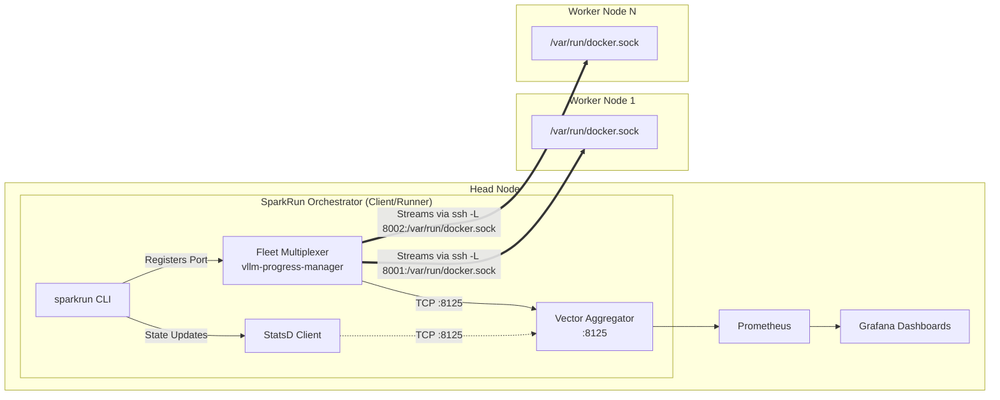

## title: Design Proposal: Multi-Node Telemetry Architecture for SparkRun state: OPEN author: jlapenna (Joe LaPenna) labels: enhancement comments: 0 assignees: projects: milestone: number: 2

# Design Document: Multi-Node Telemetry Architecture for SparkRun

## 1. Objective

Enable real-time, distributed deployment and status telemetry across DGX Spark clusters orchestrated by `sparkrun`. The telemetry must provide deep observability into the lifecycle of model loading, cluster provisioning, and orchestration progress without compromising the agentless, secure nature of the `sparkrun` framework.

## 2. Requirements

### 2.1 Functional Requirements

- **FR1:** `sparkrun` orchestrator clients must be able to transmit "phase" and "step" metrics (e.g., Progress %) to a central telemetry collector (Vector/Prometheus).
- **FR2:** Worker nodes executing distributed tasks (via bash scripts piped over SSH) must be able to push runtime metrics back to the central telemetry collector.
- **FR3:** Metrics must support the StatsD format (for gauges, counters, timers).
- **FR4:** The telemetry system must seamlessly map container and model identities (e.g., `#model_id`, `#node_id`).

### 2.2 Non-Functional Requirements

- **NFR1 (Agentless):** No persistent daemon installations (like Vector, Telegraf, or Promtail) are permitted on worker compute nodes.
- **NFR2 (Secure):** Telemetry ports (e.g., StatsD UDP/TCP 8125) must **not** be exposed over the public internet or open host firewalls.
- **NFR3 (Network Agnostic):** Worker scripts must not rely on discovering the dynamic, routable IP address of the head node.
- **NFR4 (Ephemeral State):** Metrics should not permanently "stick" in a stale state if a job crashes mid-flight.

______________________________________________________________________

## 3. Proposed Design: Centralized Fleet Telemetry via SSH Forward Tunnels

To maintain strict alignment with `sparkrun`'s agentless philosophy, telemetry will be orchestrated using a centralized **Fleet Multiplexer** combined with **SSH Local Port Forwarding**.

Instead of running a sidecar container on the worker node to push metrics back, the head node will securely query container states, execution outputs, and inference health APIs directly from the remote worker's Docker daemon. When `sparkrun` initiates an execution on a worker node, it establishes an SSH forward tunnel (`-L <random_port>:/var/run/docker.sock`), exposing the worker's Docker API locally on the head node. `sparkrun` then registers this local port with the centralized `vllm-progress-manager` Fleet Multiplexer.

### 3.1 Architecture Diagram



### 3.2 Execution Flow and Detached Tunnels

1. **Connection Initialization:** When `sparkrun` connects to a remote host to start a container, it establishes a background SSH forward tunnel (`-N -L <random_port>:/var/run/docker.sock`).
1. **Daemonization:** Because containers are often launched in a detached state (fire-and-forget), the SSH tunnel process is daemonized. Its PID is saved to a state file on the head node (`/tmp/sparkrun-telemetry-<host>.pid`).
1. **Registration:** `sparkrun` makes a REST call to the head node's `vllm-progress-manager` (the Fleet Multiplexer) to register the newly established local port mapped to the worker.
1. **Remote Streaming:** The Fleet Multiplexer instantiates an isolated `DockerHostMonitor` task. This task connects to the forwarded local port (via `tcp://host.docker.internal:<port>`), and opens continuous HTTP streams to the worker's Docker API (using `follow=1`). This continuous stream is used to execute health checks, parse container states, and track phase progressions for containers labelled `sparkrun.monitoring=true` without inefficient polling loops.
1. **Local Pushing:** The Fleet Multiplexer pushes parsed metrics to its local Vector ingestion port (`127.0.0.1:8125`), tagging the metrics with the appropriate `host` and `model_id`.
1. **Clean Teardown:** When a user executes `sparkrun stop <host>`, the orchestrator reads the PID file, terminates the SSH tunnel daemon, and sends a `DELETE` request to the Fleet Multiplexer to unregister the node.

______________________________________________________________________

### 3.3 Tunnel Persistence Options

To keep the telemetry tunnel alive while the container runs in a detached state (after `sparkrun run` exits), two architectural options were considered:

#### Option 1: Client-Side Daemonized Tunnels (Selected)

In this approach, `sparkrun run` spawns the SSH tunnel as a background daemon, saving its PID to a local file. The `sparkrun stop` command is later responsible for reading the PID and killing the tunnel.

**Why this approach is superior:**

- **Security:** Private SSH keys and credentials remain strictly on the host executing `sparkrun`. They are never transmitted over the network or stored in the monitoring stack.
- **Separation of Concerns:** The Fleet Multiplexer doesn't need to know anything about SSH, authentication, or network boundaries—it just receives generic HTTP traffic.
- **Simpler Docker Image:** The `vllm-progress-manager` container remains a lightweight Python process without needing SSH binaries or key mounts.

*Risk Mitigation:* The primary risk of this approach is dangling processes if the host reboots or `sparkrun stop` fails. We mitigate this through robust state management in `/tmp/`.

#### Option 2: Server-Side Tunnels (Rejected)

In this approach, `sparkrun run` sends the SSH connection details (Host IP, Username) to the Fleet Multiplexer API. The Multiplexer then spawns and manages its own SSH tunnels to the remote nodes.
**Why it was rejected:**

- **Secret Management:** Supplying SSH keys to the containerized Fleet Multiplexer is highly complex and a major security risk.
- **Scope Creep:** The Multiplexer container would need an SSH client and subprocess management, making it significantly heavier.

______________________________________________________________________

### 3.4 Implementation Details

The `sparkrun` orchestrator launches the tunnel and daemonizes the process if running in detached mode:

```python
import socket
import subprocess
import time
import urllib.request
import json
import os

class TelemetryTunnel:
    """Manages the creation and daemonization of an SSH forward tunnel for remote Docker telemetry."""

    def __init__(self, host: str, ssh_user: str | None = None, ssh_key: str | None = None, ssh_options: list[str] | None = None):
        self.host = getattr(host, "name", str(host))
        self.ssh_user = ssh_user
        self.ssh_key = ssh_key
        self.ssh_options = ssh_options

    def establish_detached(self):
        # 1. Find an open ephemeral port binding to 0.0.0.0
        with socket.socket(socket.AF_INET, socket.SOCK_STREAM) as s:
            s.bind(("0.0.0.0", 0))
            local_port = s.getsockname()[1]

        # 2. Start SSH forward tunnel: ssh -N -L 0.0.0.0:local_port:/var/run/docker.sock host
        cmd = build_ssh_cmd(self.host, self.ssh_user, self.ssh_key, self.ssh_options)
        cmd.extend(["-N", "-L", f"0.0.0.0:{local_port}:/var/run/docker.sock"])
        
        # Launch detached
        tunnel_proc = subprocess.Popen(cmd, stdout=subprocess.DEVNULL, stderr=subprocess.DEVNULL)
        
        # Save PID to state file
        pid_file = f"/tmp/sparkrun-telemetry-{self.host}.pid"
        with open(pid_file, "w") as f:
            f.write(str(tunnel_proc.pid))
            
        time.sleep(1)

        # 3. Register with Fleet Multiplexer API (using host.docker.internal)
        try:
            req = urllib.request.Request("http://127.0.0.1:8126/api/nodes", method="POST")
            req.add_header("Content-Type", "application/json")
            data = json.dumps({"host_id": self.host, "docker_url": f"tcp://host.docker.internal:{local_port}"}).encode("utf-8")
            urllib.request.urlopen(req, data=data, timeout=2.0)
        except Exception as e:
            print(f"Failed to register node: {e}")

    @staticmethod
    def cleanup(host: str):
        # 1. Deregister from Fleet Multiplexer
        try:
            req = urllib.request.Request(f"http://127.0.0.1:8126/api/nodes/{host}", method="DELETE")
            urllib.request.urlopen(req, timeout=2.0)
        except Exception:
            pass

        # 2. Kill the SSH tunnel
        pid_file = f"/tmp/sparkrun-telemetry-{host}.pid"
        if os.path.exists(pid_file):
            with open(pid_file, "r") as f:
                pid = int(f.read().strip())
            try:
                os.kill(pid, 15)  # SIGTERM
            except ProcessLookupError:
                pass
            os.remove(pid_file)
```
